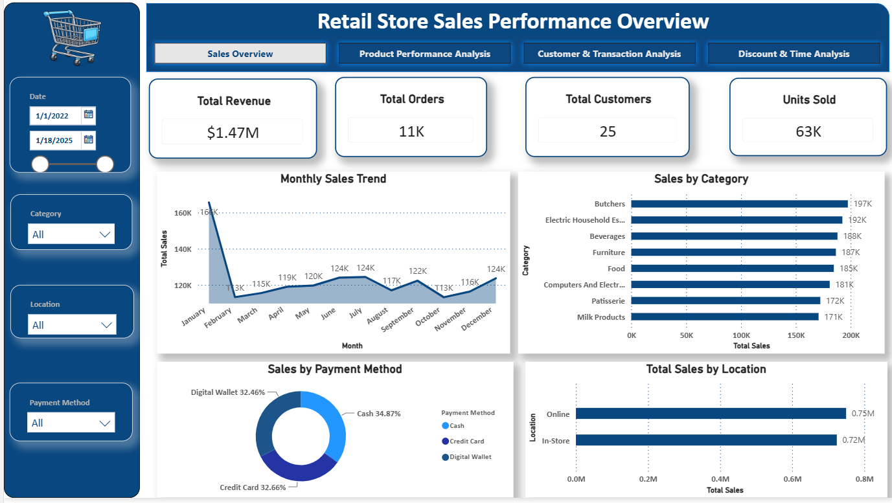
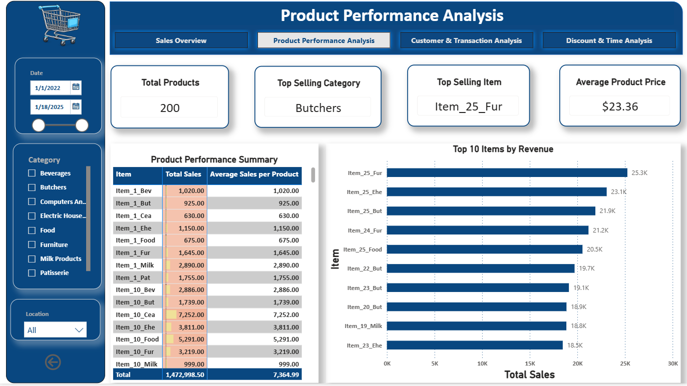
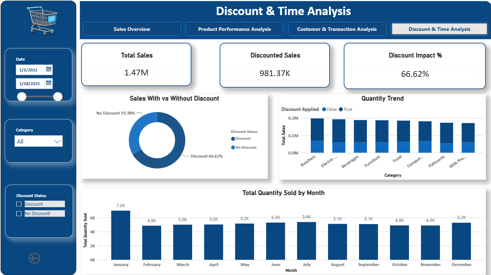
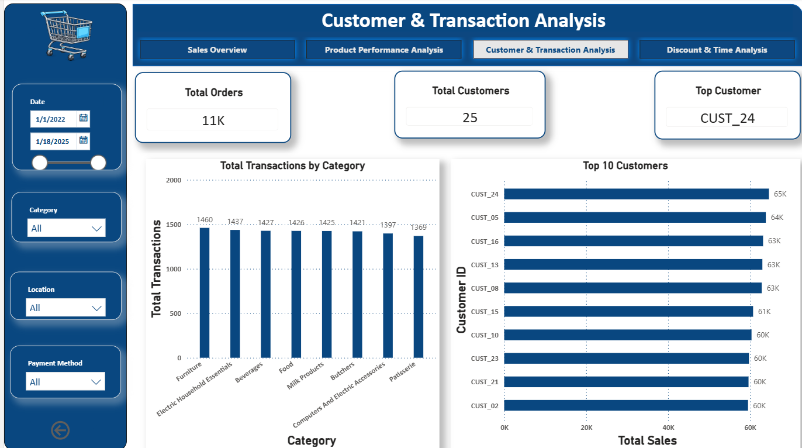

# 🛒 Retail Store Sales Analytics Dashboard

## Transforming raw retail data into actionable business intelligence using Excel and Power BI

This project demonstrates an end-to-end data analytics workflow, beginning with raw data collection, followed by data cleaning and transformation in Microsoft Excel, and culminating in the development of an interactive Power BI dashboard.The primary objective of this analysis is to uncover meaningful insights into customer purchasing behavior, product performance, sales trends, payment preferences, and regional performance. The dashboard enables stakeholders to monitor key performance indicators (KPIs), identify growth opportunities, and support strategic decision-making through data visualization.

### Business Objectives

This project aims to answer several important business questions:

 * Which product categories generate the highest revenue?
 * Which individual products contribute the most to sales?
 * Which sales channels or locations perform best?
 * How do discounts influence customer purchasing behavior?
 * Which payment methods are preferred by customers?
 * How do sales fluctuate across different months?
 * Which categories contribute the highest transaction volume?

### Dataset Information

##### Source: Kaggle

##### Dataset: Retail Store Sales (Dirty Dataset for Data Cleaning)

The dataset contains transactional retail data, including:

* Transaction Details
* Product Information
* Product Category
* Quantity Sold
* Unit Price
* Discount Applied
* Customer Details
* Payment Method
* Store Location
* Sales Amount
* Transaction Date

The original dataset intentionally contained inconsistencies and data quality issues, making it suitable for practicing real-world data cleaning techniques.

### Phase 1 – Data Preprocessing (Microsoft Excel)

Before visualization, the raw dataset was carefully cleaned and transformed to improve data quality and ensure reliable analysis.

#### Data Cleaning Activities 

 * Removed duplicate transaction records
 * Handled missing and blank values
 * Corrected inconsistent text formatting
 * Standardized category names
 * Standardized payment methods
 * Corrected inconsistent date formats
 * Converted columns to appropriate data types
 * Removed extra spaces and formatting errors
 * Verified numerical accuracy
 * Created additional date fields (Year, Month, Day)
 * Created Pivot Tables
 * Prepared the dataset for Power BI modeling

#### Challenges Encountered

Working with raw retail data presented several practical challenges:

 * Missing values across multiple columns
 * Inconsistent naming conventions
 * Mixed date formats
 * Duplicate entries
 * Data type mismatches
 * Incomplete categorical information

Addressing these issues ensured that the final dataset was accurate, consistent, and analysis-ready.

### Phase 2 – Interactive Power BI Dashboard

After preprocessing, the cleaned dataset was imported into Power BI to build an interactive business intelligence dashboard.

The dashboard provides a comprehensive overview of sales performance through dynamic visualizations, KPIs, and filtering capabilities.

#### Dashboard Components

##### KPIs

 * Total Sales
 * Total Products
 * Total Customers
 * Units Sold
 * Top Selling Item
 * Top Selling Category
 * Average Product Price
 * Discounted Sales
 * Discount Impact %

##### Visualizations

 * Monthly Sales Trend
 * Sales by Category
 * Total Quantity Sold by Month
 * Sales by Payment Method
 * Product Performance Summary
 * Total Sales by Location
 * Top 10 Customers
 * Top 10 Items by Revenue
 * Quantity Trend
 * Sales With Vs Without Discount
 * Total Transactions By Category

Interactive slicers allow users to explore data dynamically across different dimensions.

##### DAX Measures Implemented

The dashboard includes several custom DAX measures, including:

 * Total Sales
 * Total Products
 * Total Customers
 * Total Orders
 * Discounted Sales
 * Non-Discount Sales
 * Total Transactions
 * Average Sales per Product
 * Discount Impact%
 * Total Quantity Sold
 * Previous Month Sales

These calculations enhance the dashboard by providing dynamic metrics and business insights.

### Key Business Insights Based on the analysis:

* Total Revenue reached $1.47M.
* The dataset contains 200 unique products.
* 25 customers generated over 63K units sold.
* Furniture emerged as the highest-performing category.
* ITEM_25_FUR was the best-selling product.
* Online was the highest revenue-generating location.
* Cash was the most frequently used payment method.
* Products sold with discounts contributed significantly to overall sales.
* January recorded the highest sales volume among all months.

### Business Recommendations

* Increase inventory for high-demand products to avoid stock shortages.
* As online is the top-performing sales location, invest in enhancing the online shopping experience through personalized recommendations, faster delivery and     digital marketing initiatives.
* Focus on peak sales period (January) by planning inventory, staffing and marketing campaigns around peak demand period.
* Monitor customer purchasing trends to create targeted marketing campaigns and customer retention strategies.
* Analyze underperforming product categories to identify opportunities for pricing adjustments, promotional offers or product assortment improvements.
* The analysis indicates that sales increase when discounts are offered so introduce targeted promotional campaigns during off-peak periods to maximize revenue
  while maintaining healthy profit margins.

### Tools & Technologies Used

Microsoft -                                     Excel	Data Cleaning, Transformation, Pivot Analysis
Power BI -                                    Dashboard Development and Data Visualization
DAX	-                                         Calculated Measures and Business Metrics
Kaggle -                                     	Dataset Source

